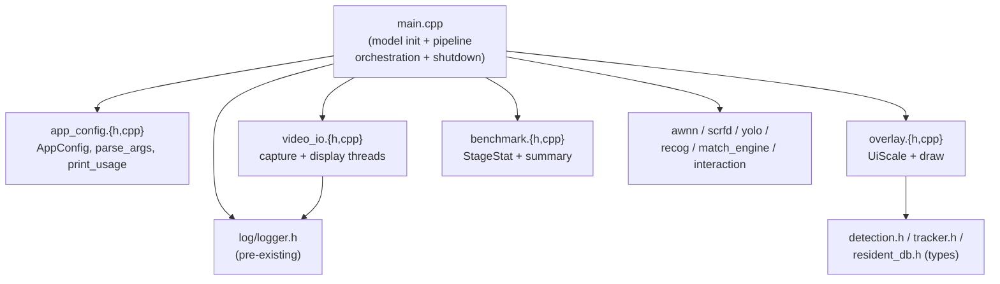
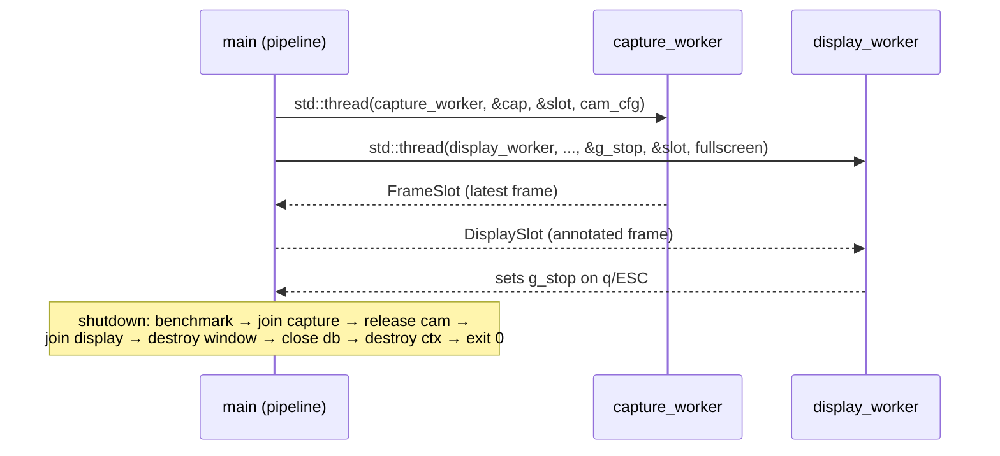

# Design Document

## Overview

`src/main.cpp` (~980 lines) concentrates six responsibilities in one translation
unit: CLI/argument parsing, threaded video capture with reconnect, threaded
display, UI scaling + overlay drawing, the recognition pipeline loop, and
benchmark accounting. This design extracts four cohesive modules and leaves
`main.cpp` as model initialization + pipeline orchestration.

This is a **pure refactor**. The design's north star is the behavioral
equivalence goal from `requirements.md`: the Refactored_App must be
byte-for-byte identical to the Baseline_App in CLI surface, log lines, benchmark
table, recognition/matching/interaction outcomes, exit codes, and threading
behavior. No flag, string, library, or dependency changes.

Extracted modules:

| Module | Files | Owns |
| --- | --- | --- |
| Config_Module | `src/app_config.{h,cpp}` | `AppConfig`, `parse_args()`, `print_usage()` |
| Video_IO_Module | `src/video_io.{h,cpp}` | `FrameSlot`, `CamConfig`, `DisplaySlot`, `open_capture()`, `capture_worker()`, `display_worker()`, `build_gst_pipeline()`, `is_stream_source()` |
| Overlay_Module | `src/overlay.{h,cpp}` | `UiScale` + `compute()`, tracker-mode overlay, SCRFD-only overlay, HUD bar |
| Benchmark_Module | `src/benchmark.{h,cpp}` | `StageStat`, benchmark summary table print |
| Main_Module | `src/main.cpp` (trimmed) | model init (order + exit codes), `FaceLabel` + face→track association + recog scheduling, interaction state machine, thread spawn, shutdown |

### Key design decisions

- **Extract by moving, not rewriting.** Every moved function keeps its exact
  body, control flow, and signature. Log strings, `printf` formats, and usage
  text move verbatim. This maximizes reviewability (Req 6.3) and minimizes the
  surface for behavioral drift.
- **Move state via plain structs and free functions**, mirroring the current
  file-static style. No new classes, no RAII wrappers, no ownership changes —
  those would be behavioral risk with no requirement backing them.
- **`g_stop` + `on_signal` stay in `main.cpp`.** The signal handler must set a
  translation-unit-visible atomic that the pipeline loop polls. It is passed to
  `display_worker` by pointer exactly as today, so Video_IO does not own the
  stop flag (matches Baseline threading model, Req 1.4).
- **`resolve_log_config` stays called in `main`.** It is a pre-existing symbol
  from the system-logging spec (declared in `log/logger.h`), unchanged by this
  refactor. `main` keeps calling it with the same `to_file`/`dir` defaults
  (Req 2.3).
- **Extracted symbols are APP-only.** None of the four modules are used by any
  binary other than `face_recog_app`, so they go in an app-only source list in
  the Makefile, **not** in `COMMON_SRCS` (Req 4.7, 5.3).

## Architecture

### Dependency direction (post-refactor)



Dependencies flow one way: `main` depends on the four new modules; the modules
depend only on the types they need (OpenCV, detector/tracker/resident types, the
logger). No module depends on `main`, and no module depends on another new
module. This keeps each unit independently compilable and reviewable.

### Threading model (unchanged — Req 1.4)

Exactly three threads, spawned in `main` exactly as today:



`capture_worker` and `display_worker` move into Video_IO with identical bodies.
`main` still constructs the `std::thread` objects, owns `g_stop`, and drives the
shutdown ordering in Req 1.5.

## Components and Interfaces

### Config_Module — `src/app_config.h`

`AppConfig` holds every parsed field with the exact Baseline default. `parse_args`
reproduces the Baseline argv loop verbatim (positional handling, the `sv()`
value-flag helper requiring `i+1 < argc`, `atoi`/`atof` coercion, unknown-flag
ignore, `-h/--help` → print usage + signal exit 0). `print_usage` moves the
Baseline format string byte-for-byte.

```cpp
#pragma once
#include <string>

struct AppConfig {
    // Positional / paths (defaults match Baseline_App exactly)
    const char* det_model_path    = "model/face_det/scrfd_2.5g_bnkps640_uint8_a733.nb";
    const char* recog_model_path  = nullptr;
    const char* face_db_path      = nullptr;
    const char* resident_db_path  = nullptr;
    const char* person_model_path = nullptr;
    const char* source_url        = nullptr;
    const char* custom_pipeline   = nullptr;

    int    cam_id           = 0;
    int    max_frames       = 0;
    int    recog_dim        = 512;
    int    gst_latency_ms   = 100;
    int    reconnect_min_ms = 500;
    int    reconnect_max_ms = 10000;
    int    person_every     = 1;
    int    track_max_miss   = 30;
    int    recog_retry      = 90;
    int    cabin_id         = 1;
    int    confirm_streak   = 5;
    double cooldown_ms       = 3000.0;
    double unknown_after_ms  = 2000.0;
    float  track_iou         = 0.3f;
    float  person_thr        = 0.5f;
    float  ui_scale_override = 0.0f;
    bool   recog_rgb         = true;
    bool   fullscreen        = true;
    float  match_threshold   = 0.35f;
};

// Prints the Baseline usage text (byte-for-byte) to stderr.
void print_usage(const char* prog);

// Parses argv into cfg using the exact Baseline loop. Returns false when
// -h/--help was seen (caller prints usage — already printed here — and
// exits 0), true otherwise. `out_help` mirrors that signal for the caller.
struct ParseResult { bool help_requested = false; };
ParseResult parse_args(int argc, char** argv, AppConfig& cfg);
```

Rationale for the `ParseResult`/help signal: the Baseline calls `print_usage`
and `return 0` inline inside `main`. To keep exit-code ownership in `main`
(Req 1.3), `parse_args` prints usage on `-h/--help` (preserving stderr + text)
and reports the help request; `main` then `return 0`. Observable behavior
(usage on stderr, exit 0) is unchanged.

Derived flags (`use_tracker`, `is_stream`, resident-db precedence, `recog_enabled`)
are computed in `main` from `AppConfig` exactly as today, so the derivation stays
next to the init code that consumes it (Req 2.6). See Property 2.

### Video_IO_Module — `src/video_io.h`

```cpp
#pragma once
#include <atomic>
#include <condition_variable>
#include <cstdint>
#include <mutex>
#include <string>
#include <opencv2/core.hpp>
#include <opencv2/videoio.hpp>

struct FrameSlot {
    std::mutex               mtx;
    std::condition_variable  cv_new;
    cv::Mat                  latest;
    uint64_t                 seq  = 0;
    bool                     stop = false;
};

struct CamConfig {
    bool        is_stream   = false;
    std::string pipeline;
    int         cam_id      = 0;
    int         cam_w       = 640;
    int         cam_h       = 480;
    int         cam_fps     = 30;
    int         backoff_min_ms = 500;
    int         backoff_max_ms = 10000;
    int         fail_reopen_threshold = 30;
};

struct DisplaySlot {
    std::mutex               mtx;
    std::condition_variable  cv_new;
    cv::Mat                  latest;
    uint64_t                 seq  = 0;
    bool                     stop = false;
    int                      last_key = -1;
};

bool        open_capture(cv::VideoCapture& cap, const CamConfig& cfg);
void        capture_worker(cv::VideoCapture* cap, FrameSlot* slot, CamConfig cfg);
void        display_worker(const char* win_name, DisplaySlot* slot,
                           std::atomic<bool>* stop_flag,
                           FrameSlot* capture_slot, bool fullscreen);
std::string build_gst_pipeline(const std::string& url, int latency_ms);
bool        is_stream_source(const std::string& s);
```

All six functions and three structs move verbatim. Log strings inside
`capture_worker`/`open_capture` (`"cam"` tag) move unchanged (Req 3.1). The
`std::atomic<bool>* stop_flag` argument keeps `g_stop` owned by `main`.

### Overlay_Module — `src/overlay.h`

`UiScale` and its `compute()` move verbatim (pure numeric function — see
Property 5). The two overlay branches and the HUD bar become free functions that
take the loop's data by reference/value so they do no I/O and own no state.

```cpp
#pragma once
#include <cstdint>
#include <map>
#include <vector>
#include <opencv2/core.hpp>
#include "detection.h"     // Detection
#include "tracker.h"       // Track, Tracker
#include "resident_db.h"   // Resident

struct UiScale {
    float scale       = 1.0f;
    int   line_thick  = 2;
    int   line_thin   = 1;
    int   text_thick  = 2;
    int   text_thin   = 1;
    float font_label  = 0.6f;
    float font_hud    = 0.5f;
    int   hud_h       = 32;
    int   hud_pad_x   = 6;
    int   hud_text_y  = 20;
    int   landmark_r  = 2;
    static UiScale compute(int frame_h, float override_val);
};

// FaceLabel is defined in main.cpp (see Data Models). The overlay functions
// receive exactly the data the Baseline draw block reads.

// Tracker-mode overlay: person track rectangles + labels, then face bboxes.
void draw_tracker_overlay(cv::Mat& frame, Tracker& tracker,
                          const std::vector<Detection>& faces,
                          const std::map<int, int64_t>& track_resident_id,
                          const std::map<int64_t, Resident>& resident_by_id,
                          const UiScale& ui, bool use_resident_db);

// SCRFD-only overlay: face bbox + label + landmarks.
struct FaceLabel;   // fwd-declared; concrete type lives in main.cpp
void draw_scrfd_overlay(cv::Mat& frame,
                        const std::vector<Detection>& faces,
                        const std::vector<FaceLabel>& face_labels,
                        const std::map<int64_t, Resident>& resident_by_id,
                        const UiScale& ui, bool recog_enabled,
                        bool use_resident_db);

// HUD bar: darkened top strip + timing string.
void draw_hud(cv::Mat& frame, const char* hud_text, const UiScale& ui);
```

Design note on `FaceLabel`: the SCRFD-only overlay reads `FaceLabel` fields, but
`FaceLabel` is intimately tied to the pipeline loop (association + recognition
scheduling populate it) and stays in `main.cpp` (see Data Models, Req 4.5). The
overlay header forward-declares it and the definition is shared with the overlay
`.cpp` via a small internal header include, OR the overlay functions accept the
already-formatted label string. To keep the move purely mechanical and avoid a
new shared type, `FaceLabel` is promoted to a small standalone header
`src/face_label.h` included by both `main.cpp` and `overlay.cpp`. This header is
data-only (no logic) and is the single documented structural addition
(Req 6.4). The label-string formatting (`std::snprintf(lbl, ...)`) stays
verbatim inside the overlay functions so drawn text is byte-identical.

All drawing calls (`cv::rectangle`, `cv::putText`, `cv::circle`,
`cv::addWeighted`), colors, thickness, font scales, and label `snprintf` formats
move unchanged (Req 1.1 overlay equivalence, Req 3 no string changes).

### Benchmark_Module — `src/benchmark.h`

```cpp
#pragma once
#include <algorithm>

struct StageStat {
    double sum = 0.0, mn = 1e9, mx = 0.0;
    int    n   = 0;
    void   add(double v) { sum += v; mn = std::min(mn, v); mx = std::max(mx, v); ++n; }
    double avg() const { return n ? sum / n : 0.0; }
};

// Prints the "===== BENCHMARK SUMMARY =====" block to stdout using the exact
// Baseline printf format specifiers, row labels, and column ordering.
void print_benchmark_summary(double run_secs, int frame_id,
                             bool use_tracker, int person_every,
                             const StageStat& cap, const StageStat& pre,
                             const StageStat& yolo, const StageStat& scrfd,
                             const StageStat& recog, const StageStat& draw,
                             const StageStat& e2e);
```

Every `printf` line (including the conditional `yolo (Nx)` row gated on
`use_tracker && s_yolo.n > 0`) moves verbatim (Req 3.3 — see Property 4).

### Main_Module — trimmed `src/main.cpp`

Retains:

1. `g_stop` (atomic) + `on_signal` handler; `std::signal` registration.
2. NPU model init in the exact Baseline order — recognizer → resident/face DB →
   SCRFD → YOLO — with exit codes **1** (camera open), **2** (recognizer or
   resident-DB init), **3** (SCRFD init), **4** (YOLO create/init) preserved at
   each `return` site (Req 1.2, 1.3).
3. `FaceLabel` type (via `face_label.h`) + the per-frame face→track association,
   recognition scheduling, and DEBUG per-frame detail log (Req 3.6).
4. Interaction state machine wiring (`subjects`, `interaction.update`, match
   event logging with the `"event"` tag, `resident_db.log_event/touch_resident`).
5. Thread spawning (`capture_worker`, `display_worker`) and the pipeline `while`
   loop, including the `--frames` break (Req 1.7).
6. The shutdown sequence in the Req 1.5 order.

Calls into modules: `parse_args`/`print_usage` (Config), `open_capture` +
`capture_worker`/`display_worker` + `build_gst_pipeline`/`is_stream_source`
(Video_IO), `UiScale::compute` + `draw_*` (Overlay), `StageStat` +
`print_benchmark_summary` (Benchmark), `resolve_log_config` (pre-existing logger).

## Data Models

### AppConfig
Central parsed-argument record (see Config_Module). Value semantics; no
ownership of the `const char*` paths (they point into `argv`, exactly as today).

### FaceLabel (stays with the pipeline — `src/face_label.h`)
```cpp
struct FaceLabel {
    std::string name;
    float       sim = -1.0f;
    char        stat = '.';
    int         track_id = -1;
    int64_t     resident_id = -1;
    float       area = 0.0f;
};
```
Justification for keeping it out of Overlay: `FaceLabel` is produced by the
recognition-scheduling logic that is the core of Pipeline_Behavior (Req 4.5
requires association/recog to remain in Main). Overlay only *reads* it, so a
data-only header shared by both is the minimal coupling. Promoting it to
`face_label.h` (vs a local `main.cpp` struct) is the one intentional structural
change, documented per Req 6.4.

### Video slots — FrameSlot, DisplaySlot, CamConfig
Move verbatim to Video_IO (see interfaces). Synchronization fields
(`std::mutex`, `std::condition_variable`, `seq`, `stop`) unchanged, preserving
the exact producer/consumer handshake and thus threading behavior (Req 1.4).

### StageStat
Move verbatim to Benchmark. Accumulator with `sum/mn/mx/n` and `avg()`; feeds
the summary printer.

### UiScale
Move verbatim to Overlay. Pure function of `(frame_h, override_val)`; the sole
source of overlay geometry (Property 5).

## Correctness Properties

*A property is a characteristic or behavior that should hold true across all
valid executions of a system — essentially, a formal statement about what the
system should do. Properties serve as the bridge between human-readable
specifications and machine-verifiable correctness guarantees.*

For this pure refactor, the highest-value properties are **differential**: they
compare the extracted unit against a frozen reference model of the Baseline
behavior over generated inputs. All four cover pure/near-pure units that need no
NPU, camera, or AI SDK, so they run on the Windows dev host (Req 6.3). Full
pipeline equivalence (Req 1.1/1.6), log emission (Req 3.1/3.2), and build/link
(Req 5) require the target toolchain and are handled as example/integration
checks (see Testing Strategy) rather than properties.

### Property 1: CLI parse differential equivalence

*For any* argument vector `argv` (including well-formed flags, omitted flags,
extra positional arguments beyond two, unknown flags, value-flags with no
following value, and non-numeric values for numeric flags), `parse_args` SHALL
produce an `AppConfig` whose every field equals the field the Baseline argv loop
would produce for the same `argv` — including retaining defaults for absent
arguments, consuming at most two positionals, ignoring extra positionals, and
ignoring malformed arguments without error while continuing to parse the rest.

**Validates: Requirements 2.1, 2.2, 2.4, 2.7**

### Property 2: Derived-flag equivalence

*For any* `AppConfig`, the flags derived in `main` — `use_tracker`
(person-model present), `recog_enabled` (recog-model present), `is_stream`
(custom pipeline present, or source URL that `is_stream_source` accepts), and
resident-DB-over-face-DB precedence (resident-db path wins when both present) —
SHALL equal the values the Baseline_App derives from the same inputs.

**Validates: Requirements 2.6**

### Property 3: Usage-text byte-equality

*For any* program name string `prog`, the bytes written by `print_usage(prog)`
SHALL equal the Baseline usage text with `prog` substituted, character-for-
character, on standard error.

**Validates: Requirements 2.5**

### Property 4: Benchmark-table byte-equality

*For any* set of stage-timing aggregates (`run_secs`, `frame_id`, `use_tracker`,
`person_every`, and the seven `StageStat` values), the bytes written by
`print_benchmark_summary` SHALL equal the bytes the Baseline `printf` sequence
would write for the same aggregates — same row labels, column ordering, and
numeric format specifiers, including the conditional `yolo (Nx)` row.

**Validates: Requirements 3.3**

### Property 5: UiScale::compute equivalence

*For any* frame height `frame_h` and override value `override_val`,
`UiScale::compute(frame_h, override_val)` SHALL produce every field
(`scale`, thicknesses, font scales, HUD geometry, landmark radius) equal to the
Baseline computation for the same inputs, guaranteeing byte-identical overlay
geometry.

**Validates: Requirements 1.1**

## Error Handling

The refactor changes no error handling. Each Baseline failure branch keeps its
exit code and its cleanup sequence at the same point:

- Camera open failure → `LOG_ERROR("cam", ...)` → `return 1` (Req 1.3).
- Recognizer load / resident-DB open / `load_active` / embedding-dim mismatch →
  cleanup (`delete recognizer`, `awnn_uninit`, `shutdown_capture`) → `return 2`.
- SCRFD `init` failure → cleanup → `return 3`.
- YOLO `awnn_create`/`init` failure → cleanup → `return 4`.

The `shutdown_capture` lambda and all `awnn_destroy`/`close`/`delete` cleanup
calls stay in `main` in their existing order. Parser error handling
(unknown/malformed flags silently ignored, no exit-code change) is preserved by
moving the loop verbatim (Property 1). Capture-thread reconnect/backoff logic
moves verbatim into `capture_worker` (Video_IO), including its `"cam"` warnings.

## Testing Strategy

### Property-based tests (run on the Windows dev host — Req 6.3)

PBT applies here because the four extracted units are pure/near-pure functions
with input-varying behavior and a precise oracle (the frozen Baseline model).
Use a C++ property-testing library (**RapidCheck**, integrated into the existing
`tests/` harness); do not hand-roll generators. Each property test:

- runs a **minimum of 100 iterations**,
- is tagged `Feature: main-cpp-refactor, Property {n}: {property text}`,
- implements exactly one design property.

| Test | Property | Generator |
| --- | --- | --- |
| CLI parse differential | Property 1 | random `argv` mixing valid flags, omissions, extra positionals, unknown flags, dangling value-flags, non-numeric values |
| Derived-flag equivalence | Property 2 | random `AppConfig` path/flag combinations |
| Usage-text byte-equality | Property 3 | random `prog` strings; compare captured stderr to frozen baseline snapshot |
| Benchmark-table byte-equality | Property 4 | random stat aggregates + `use_tracker`/`person_every`; compare captured stdout to baseline `printf` model |
| UiScale::compute equivalence | Property 5 | random `frame_h` (incl. 0, 480, 720, 1080, large) and `override_val` (incl. 0, negative, fractional) |

The "baseline model" for Properties 1, 3, and 4 is a small frozen copy of the
Baseline logic (or a captured golden snapshot for usage/benchmark text) checked
into the test, since the Baseline `main.cpp` cannot be linked twice. These tests
need no OpenCV/NPU beyond header types and can build on the dev host.

### Unit / example tests

- Model-init **order and exit codes** (Req 1.2, 1.3): static-review checklist
  plus, on Linux, example runs forcing each failure (bad cam id → 1, bad
  recog/db → 2, bad scrfd → 3, bad person model → 4).
- `--frames` termination (Req 1.7) and shutdown order (Req 1.5): review + one
  small Linux run.
- Privacy R7 (Req 3.4, 3.5): grep/review that no moved `LOG_*` site passes a
  resident name, `greeting_name`, or apartment; identities logged only as
  numeric `resident_id`/`track_id`. Optional CI grep guard.
- DEBUG-only sites (Req 3.6): review that per-frame detail + frame-timing logs
  remain `LOG_DEBUG`.

### Integration tests (Linux, blocked-pending-Linux — Req 6.2)

- Full Pipeline_Behavior equivalence (Req 1.1): run Baseline_App and
  Refactored_App over an identical recorded frame sequence with fixed `--frames`,
  once per mode (SCRFD-only, YOLO+tracker); diff normalized log output and exit
  code.
- Log line equivalence (Req 3.1, 3.2): diff logs with timestamp/run-id fields
  normalized.
- q/ESC shutdown (Req 1.6): one GUI run.

### Build verification (Linux, blocked-pending-Linux — Req 5)

`make all` on the target toolchain: new `.cpp` files compile through the existing
`src/%.cpp → build/%.o` rule (Req 5.1), `face_recog_app` links with the new
objects and zero unresolved symbols (Req 5.2, 4.6), the same `LIBS` set (Req 5.3),
and no new warnings under `-Wall` vs the Baseline (Req 5.4).

## Build System Integration (Makefile edits)

The four modules are **APP-only** (used solely by `face_recog_app`), so they must
**not** join `COMMON_SRCS` (which every binary links). Introduce an app-only list
and append it to `APP_SRCS_CPP`.

Add after the `DB_SRCS` block:

```make
# App-only modules extracted from main.cpp (spec main-cpp-refactor). Used ONLY
# by face_recog_app — do NOT add to COMMON_SRCS (other tools don't need them).
APP_ONLY_SRCS := $(SRC_DIR)/app_config.cpp \
                 $(SRC_DIR)/video_io.cpp \
                 $(SRC_DIR)/overlay.cpp \
                 $(SRC_DIR)/benchmark.cpp
```

Change the `APP_SRCS_CPP` line from:

```make
APP_SRCS_CPP     := $(SRC_DIR)/main.cpp           $(COMMON_SRCS) $(RECOG_SRCS) $(DB_SRCS)
```

to:

```make
APP_SRCS_CPP     := $(SRC_DIR)/main.cpp           $(COMMON_SRCS) $(RECOG_SRCS) $(DB_SRCS) $(APP_ONLY_SRCS)
```

No other target's source list changes. `INCLUDES`, `LIBS`, `CXXFLAGS`, and the
pattern rules are untouched (Req 5.3). `APP_OBJS` is derived from `APP_SRCS_CPP`
via the existing `patsubst`, so the new objects are picked up automatically. New
headers (`app_config.h`, `video_io.h`, `overlay.h`, `benchmark.h`, `face_label.h`)
need no Makefile entry.

## Verification Environment Constraint

The developer host is Windows and cannot run the Linux/`make` toolchain or the AI
SDK. Per Req 6, the acceptance goal is: **compiles on the Target_Toolchain with
zero errors and zero new warnings, and runtime output byte-for-byte identical to
the Baseline_App across all executed code paths** (Req 6.1).

### Reviewable on Windows before Linux (Req 6.3)

- Run Properties 1–5 (they need no NPU/OpenCV runtime) on the dev host.
- Static review checklist (Req 6.3, 6.4):
  1. Each moved function body is diff-identical to its Baseline body (control
     flow, signatures).
  2. Every `LOG_*` string literal preserved verbatim in its new location
     (Req 3.1, 3.6); no name/greeting/apartment logged (Req 3.4, 3.5).
  3. Every benchmark `printf` line preserved verbatim (Req 3.3).
  4. Usage text preserved verbatim (Req 2.5).
  5. Model-init order + exit codes 1/2/3/4 unchanged (Req 1.2, 1.3).
  6. Shutdown sequence order unchanged (Req 1.5); `--frames` break unchanged
     (Req 1.7).
  7. Exactly one capture + one display thread spawned (Req 1.4).
  8. Makefile: only `APP_SRCS_CPP` extended with `APP_ONLY_SRCS`; `LIBS`
     unchanged (Req 5.3).
  9. The single intentional structural change (`FaceLabel` → `face_label.h`) is
     documented (Req 6.4).

Any difference the review detects is resolved, or explicitly recorded as
intentional, before Linux verification (Req 6.4).

### Blocked-pending-Linux (Req 6.2)

`make` build verification (Req 5.1, 5.2, 5.4, 5.5, 4.6, 4.7) and runtime
verification (Req 1.1, 1.6, 3.1, 3.2) are marked **blocked-pending-Linux**, not
failed, while work happens on Windows.

### Linux sign-off gate (Req 6.5)

The refactor is complete only after a Linux run confirms the Req 6.1 acceptance
goal: clean compile, no new warnings, and byte-identical runtime output vs the
Baseline_App across the executed code paths.
